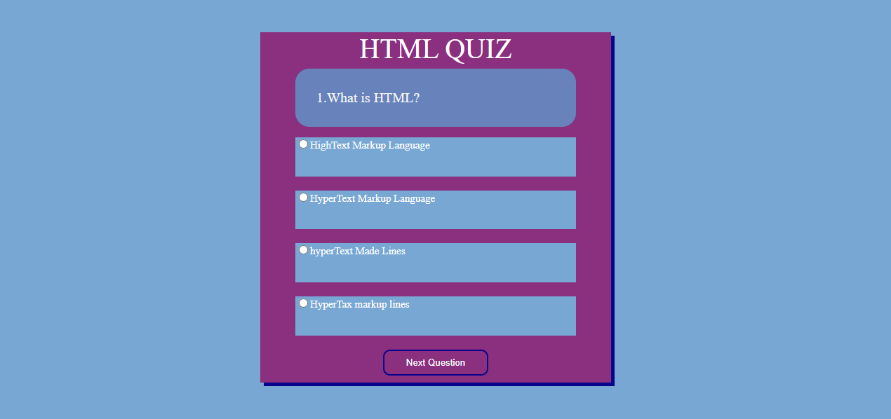
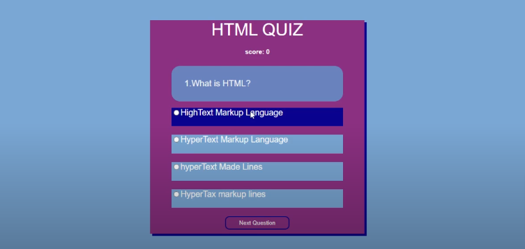
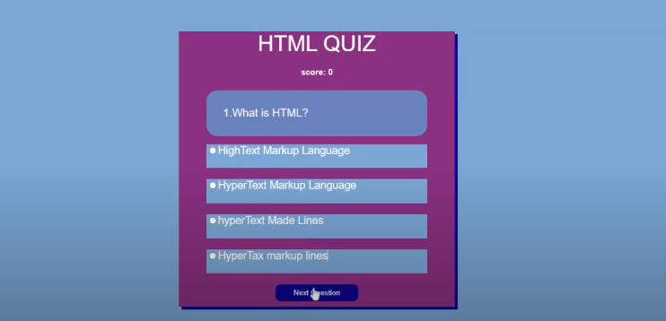
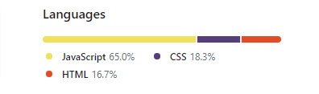
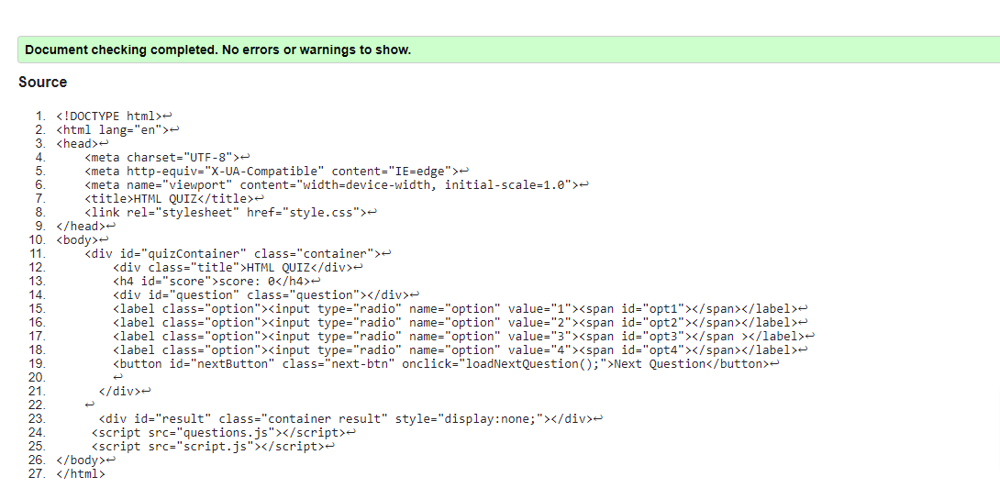
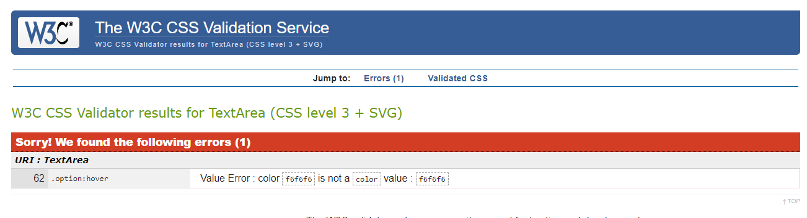
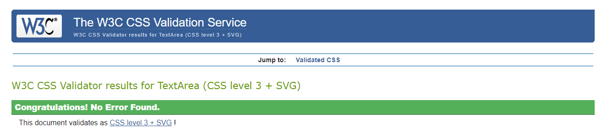
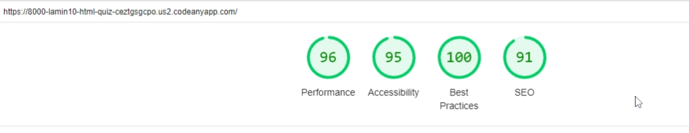
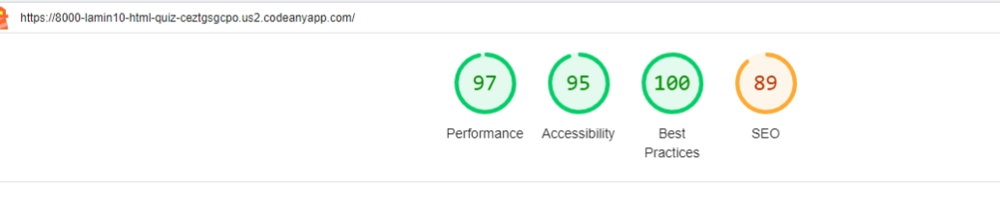

# html-quiz
HTML QUIZ is a quiz application about basic HTML.
It consist of 15 questions and each question consist of four options to choose from.
The application is made up of four components, the first is a heading of HTML QUIZ,
and after the heading is the score are which increases with every correct answer choosen
from the options and decrease on every wrong answer.
And then come the options area which consist of four options to choose from.
Lastly come the next button which moves to the next question

### HTML QUIZ
Is made up of scores area, question, options, and a next button
the background color of the body is #79a7d3 and a font-family of
Oswald and Sans-serif as a backup font.
The background of the main container is #8a307f.

### OPTIONS AREA

The options area have a background-color of #6883bc, and a
background of #08038c on hoover.

### NEXT BUTTON
The next button have a transperent background color and 
a background-color of # 08038c on hoover.

### TOTAL SCORE AREA

The total score area has a color of #f6f6f6 and a  background-color
of # 08038c

### LANGUAGES USED

The languages used in creating this quiz app are HTML CSS and javaScript.
HTML made up 16.7% of the application.
CSS made up 18.3% of the application.
JavaScript 65.0% of the application.

### WC3 VALIDATOR

#### HTML VALIDATION
No error was found when testing the html file file for bugs

### WC3 CSS VALIDATION
During the validation of the CSS file it was discovered that at line 62 
there was an error and it was found out that the color property of the options 
area on hoover was missing a hastag on the color value

After debugging the error ie adding the hastag symbol to the color value on 
line 62 there were no more errors in the css file

### SEO TESTING

#### LIGHT HOUSE SEO RESULT ON MOBILE

#### LIGHT HOUSE SEO RESULT ON DESKTOP

## CREDITS

### CONTENTS
#### VISUAL STUDIO CODE
All the code for this quiz application was done in Visual studio code and 
and then transfered to Codeanywhere by copying and pasting 

#### GITHUB
Github is the hosting platform for thisquiz app project it is the platform
for storing and tracking and version control

#### CODEANYWHERE
The project is been completed in this cross platform Cloud IDE

#### FONTS
The fonts for the quiz app was taken from google fonts

#### COLORS
**BODY:** 79a7d3.
**FONT-COLORS:** #ffff.
**MAIN CONTAINER:** #8a307f.
**QUESTION AREA:** #6883bc.
**OPTIONS AREA:** #79a7d3.
**OPTION HOOVER:** #08038c.
**BUTTON:** Transparent.
**BUTTON HOOVER:** #08038c.

